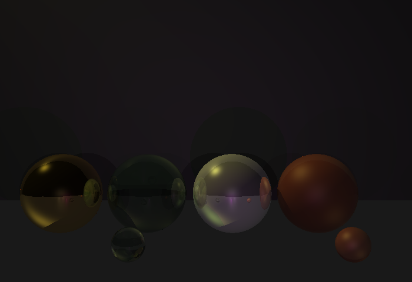
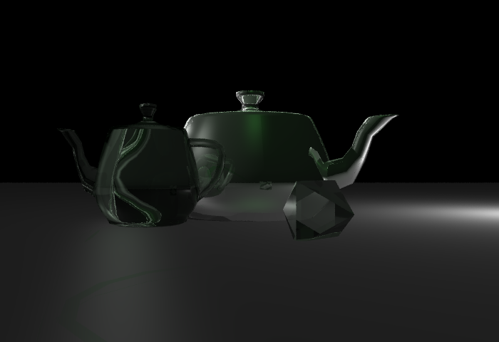
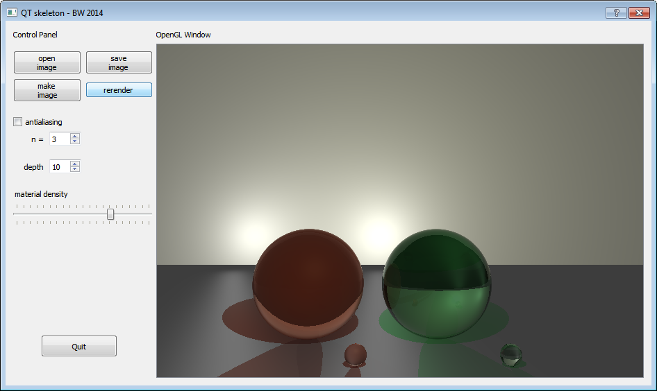

# Ray tracer

[CSC 330] 3D Computer Graphics final project

April 12, 2015

Alina Chin

Requirements:

- Qt 5.4

Includes:

- Qt Creator project files
- sample OBJ and materials files
- sample output images

Features:

-	shadows
-	specular reflection
-	refraction with approximations of Fresnel equations
-	multiple light sources
-	point and directional light sources with attenuation
-	triangle-mesh intersection
-	importing triangle meshes from .obj files
-	instancing (can apply transformations to groups of objects)
-	partially transparent objects & coloured shadows
-	jittered antialiasing
-	rendering settings can be changed in UI

Example output images:

Materials - gold, green glass, aluminum, red plastic

With antialiasing

Teapot mesh (instanced twice) - chrome, glass

Octahedron mesh - glass

With antialiasing

The user interface